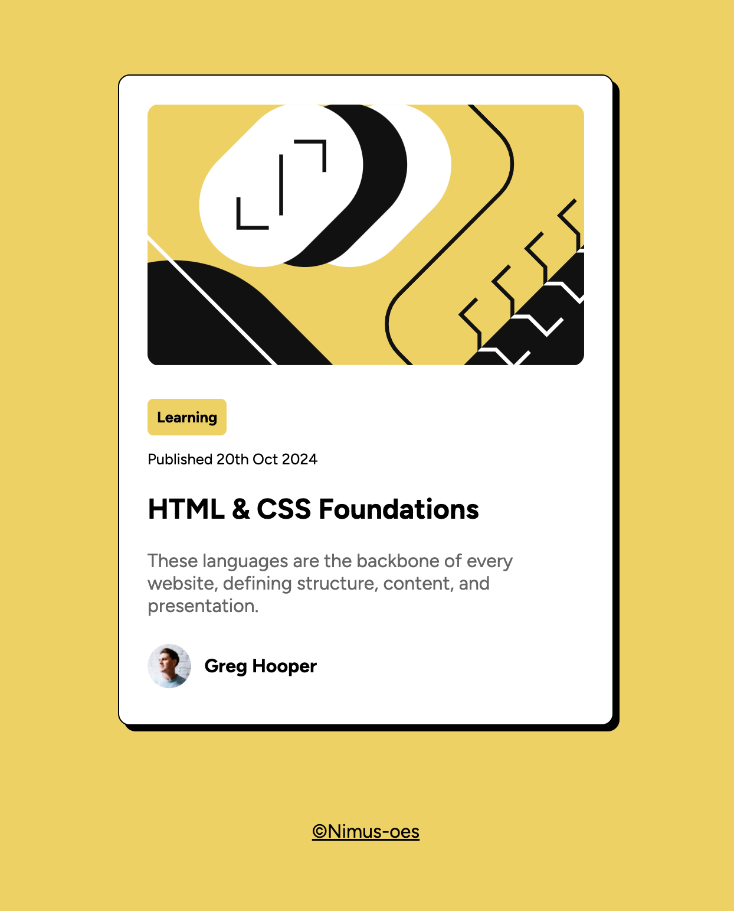

# Blog Preview Card

A blog preview card bulit with HTML and CSS

 

## Key Features Implemented

- A card design containing image, tag, and author information
- Box shadow effect
- Hover effect on the title, with a color change using the pseudo-class `:hover`
- A responsive layout for both mobile and desktop environments
- Vertical alignment of different-shaped elements (e.g., text and images) using Flexbox.

 

## Findings and Lessons

### 1. `max-width` for responsive layout

When implementing responsive designs, using `max-width` instead of `width` ensures that elements can shrink and expand fluidly without exceeding a set limit.

### 2. `%` vs. `rem` for responsive width unit

For mobile screens, `%` is often a more flexible unit for width, adapting to various screen sizes. However, on larger screens, it can result in over-scaling. Switching to `em/rem` for desktop layouts ensures more consistent scaling and better control over element sizes.

### 3. Optimizing Images for Small Elements

Resizing large images with CSS to fit small elements (like profile pictures) is not always ideal. It’s better to use pre-edited images to maintain image quality and reduce file size, thereby improving load times. CSS resizing doesn’t reduce the file size and can negatively impact performance.

 

## Future Improvements

1. Adding interactive elements, such as buttons for sharing the blog or reading more.

 

## Acknowledgments

This project is based on a challenge from <a href="https://www.frontendmentor.io/challenges/blog-preview-card-ckPaj01IcS">Frontend Mentor</a>
