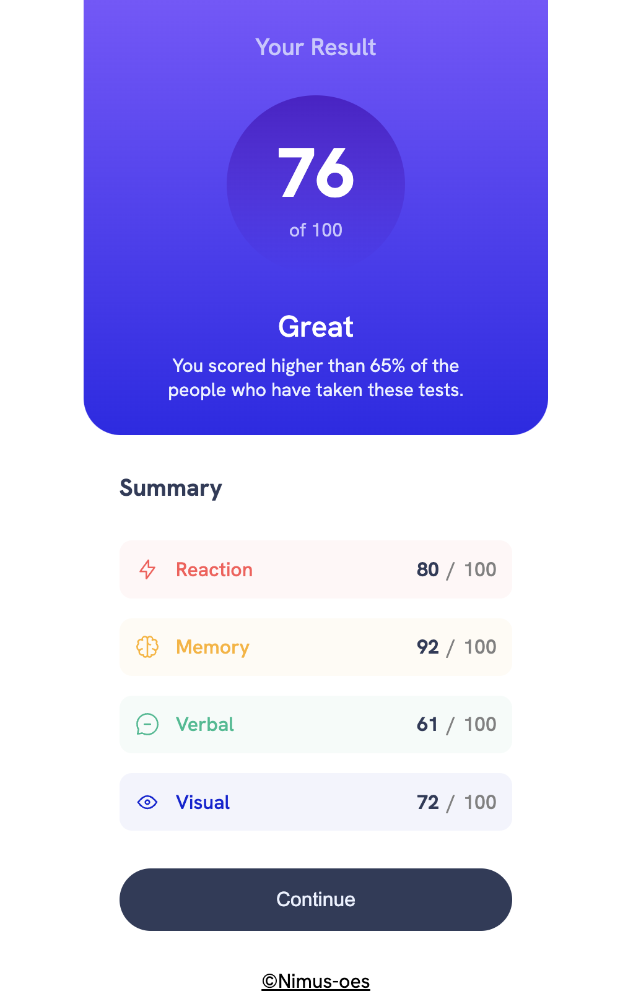
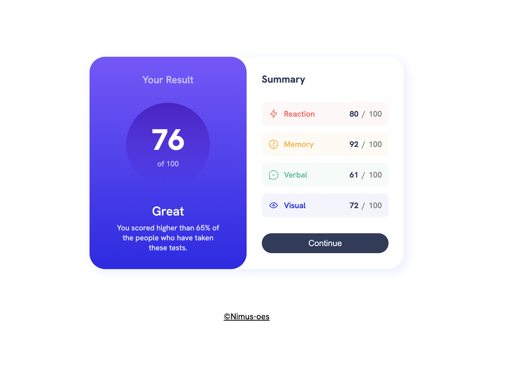
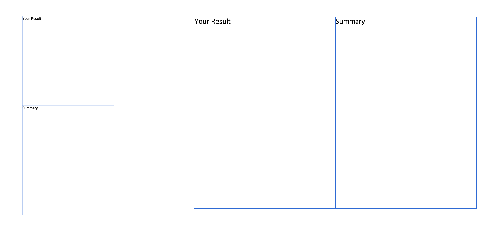
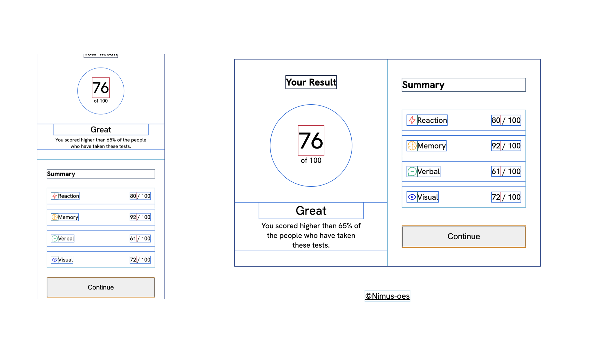
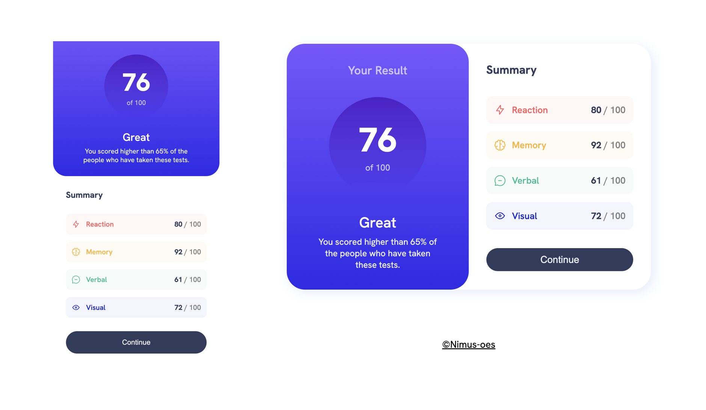

# Results Summary Component

<br>
<p align="center">

</p>
<p align="center">

</p>
<p align="center">A result summary component built with HTML and CSS</p>

<p></p>
<br>

## Key Features Implemented

- A Responsive layout switching from a column (mobile) to a row (desktop) using flexbox
- Overlapping cards with partially removed round borders on bottom side card
- Hover effects on category items, with a background color change using the pseudo-class `:hover`
- Linear gradient background

<br>

## Development Process

1. Designed the basic layout for mobile and desktop screens using flexbox



2. Structured the content with semantic HTML tags and added typography and spacing



3. Added visual details and finishing touches



<br>

## Challenges and Learnings

### 1. Choosing Between Grid and Flexbox

Both flexbox and grid could achieve the layout for this project, but each has specific use cases.

**Grid**: Ideal for two-dimensional layouts (rows and columns), equal-sized areas, and larger page structures

**Flexbox**: Best for one-dimensional layouts (row or column), dynamic content alignment, and layouts where content size drives positioning

In this project, I chose flexbox because it works well for one-dimensional layouts, shifting from a column on mobile to a row on desktop. Using flexbox with utility classes allowed nested containers without adding much CSS complexity.

<br>

### 2. `margin`-based spacing vs. `gap`

I traditionally used `margin` to create gaps between elements, but flexbox’s `gap` property simplifies spacing.

Using `margin` requires more specificity to avoid extra spacing:

```
.category:not(.category:last-of-type) {
  margin-bottom: 1rem;
}
```

Using `gap` makes codes cleaner and prevents margin collapse issues:

```
#category-container {
  gap: 1rem;
}
```

<br>

### 3. Changing background opacity without affecting child elements

If you decrease the opacity of the background of an element with `opacity` property, the opacity of the child elements will be decreased as well. The simplest way to adjust the background opacity without affecting child elements is by using color values with an alpha channel (e.g., RGBA and HSLA). However, this approach requires creating numerous variables for each color and opacity combination when multiple color variations are needed.

The problem (too many color variables and lengthy codes):

```
  :root {
  --light-red-lighter: hsla(0, 100%, 67%, 0.05);
  --light-red-light: hsla(0, 100%, 67%, 0.2);
  --light-red: hsl(0, 100%, 67%);
  --orange-yellow-lighter: hsla(39, 100%, 56%, 0.05);
  --orange-yellow-light: hsla(39, 100%, 56%, 0.2);
  --orange-yellow: hsl(39, 100%, 56%);
  --green-teal-lighter: hsla(166, 100%, 37%, 0.05);
  --green-teal-light: hsla(166, 100%, 37%, 0.2);
  --green-teal: hsl(166, 100%, 37%);
  --cobalt-blue-lighter: hsla(234, 85%, 45%, 0.05);
  --cobalt-blue-light: hsla(234, 85%, 45%, 0.2);
  --cobalt-blue: hsl(234, 85%, 45%);
  --gray: gray;
  }

#reaction-container {background-color: var(--light-red-lighter);}

#memory-container {background-color: var(--orange-yellow-lighter);}

#verbal-container {background-color: var(--green-teal-lighter);}

#visual-container {background-color: var(--cobalt-blue-lighter);}

#reaction-container:hover {background-color: var(--light-red-light);}

#memory-container:hover {background-color: var(--orange-yellow-light);}

#verbal-container:hover {background-color: var(--green-teal-light);}

#visual-container:hover {background-color: var(--cobalt-blue-light);}

#reaction-container:hover {background-color: var(--light-red-light);}

#memory-container:hover {background-color: var(--orange-yellow-light);}

#verbal-container:hover {background-color: var(--green-teal-light);}

#visual-container:hover {background-color: var(--cobalt-blue-light);}
```

**Alternative Solution:**

By using a `::before` pseudo-element, you can add a background layer behind each category’s content. Setting `z-index: -1` allows the background to change opacity without influencing any child elements, as the pseudo-element sits at a lower layer.

The solution with overlay:

```
:root {
  --light-red: hsl(0, 100%, 67%);
  --orange-yellow: hsl(39, 100%, 56%);
  --green-teal: hsl(166, 100%, 37%);
  --cobalt-blue: hsl(234, 85%, 45%);
}

#reaction-container::before {background-color: var(--light-red);}

#memory-container::before {background-color: var(--orange-yellow);}

#verbal-container::before {background-color: var(--green-teal);}

#visual-container::before {background-color: var(--cobalt-blue);}

.category::before {
  content: "";
  position: absolute;
  top: 0;
  left: 0;
  width: 100%;
  height: 100%;
  opacity: 0.05;
  z-index: -1;
  border-radius: inherit;
}

.category:hover::before {
  opacity: 0.2;
}
```

<br>

### 4. Choosing semantic HTML tags: `<section>`, `<article>`, or `<ul>` for category items

For related category items (Reaction, Memory, Verbal, Visual), I used `<ul>` to reflect the items' nature as related yet unordered content. Each tag has its unique purpose:

- `<section>`: An element to group related content with a heading
- `<article>`: An element to represent standalone content for independent distribution
- `<ul>`: An element to list unordered, non-numerically ordered items

As the category items are dependent on their container’s context and do not have a heading, `<ul>` best fits here.

<br>

## Improvement Logs

- Removed alt text for decorative images that do not add information and hid them from screen readers with `aria-hidden="true"`
- Organized CSS code into logical groups
- Used `preconnect` for web fonts and limited imports to only needed weights
- Replaced explicit height in a circle-shaped box with `aspect-ratio: 1`, enhancing flexibility and maintainability

<br>

## Continued Development

- Gain a deeper understanding of WCAG accessibility requirements
- Enhance accessibility with `:focus-visible` for better keyboard navigation
- Further explore the `flex` property to refine flexbox layouts

<br>

## Useful Resources

- [Decorative Images (W3C)](https://www.w3.org/WAI/tutorials/images/decorative/) - Guidance on types of decorative images that do not add additional information, and how to handle them in HTML
- [How to Change the CSS Background Opacity (Sentry)](https://sentry.io/answers/how-to-change-the-css-background-opacity-of-an-element/) - Techniques for adjusting background opacity in CSS while preserving child element styles

- [Organizing your CSS (MDN)](https://developer.mozilla.org/en-US/docs/Learn/CSS/Building_blocks/Organizing) - Tips on organizing CSS code, covering methodologies like OOCSS, BEM, and the use of pre/post-processors.

- [5 Tips To Make Google Fonts Faster (Request Metrics)](https://requestmetrics.com/web-performance/5-tips-to-make-google-fonts-faster/) - Tips for optimizing Google Fonts to improve loading speed and performance.

<br>

## Acknowledgments

This project is inspired by [the challenge from Frontend Mentor](https://www.frontendmentor.io/challenges/results-summary-component-CE_K6s0maV).
