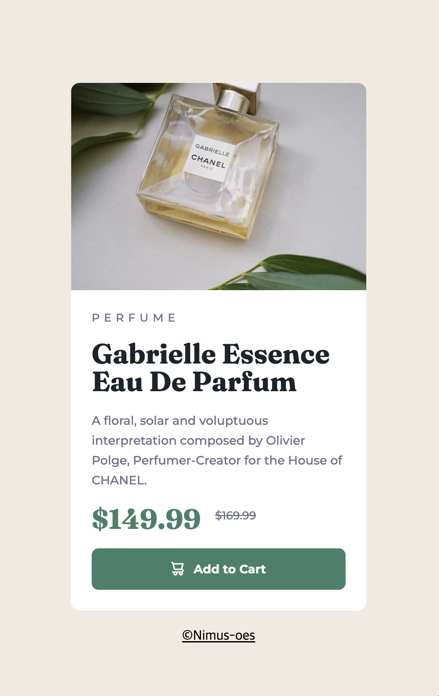

# Product Preview Card

 

A product preview card built with HTML and CSS

 

## Key Features Implemented

- A responsive layout switching from a column (mobile) to a row (desktop) using flexbox
- A responsive image switching art directions between mobile and desktop screens using `<picture>`
- Responsive text and elements that adjust to the default font size of browsers using a relative unit `rem`
- Strikethrough text with visually hidden information for enhanced accessibility
- Hover effects on the button using the pseudo-class `:hover`

 

## Development Process

1. Designed the basic layout for mobile and desktop screens using flexbox

2. Structured the content with semantic HTML tags

3. Added typography and spacing

4. Added visual details and finishing touches

 

## What I learned

### 1. Choosing Between Grid and Flexbox

 

### 2. `margin`-based spacing vs. `gap`

 

### 3. Changing background opacity without affecting child elements

 

### 4. Choosing semantic HTML tags: `<section>`, `<article>`, or `<ul>` for category items

 

## Improvement Logs

- Removed alt text for decorative images that do not add information and hid them from screen readers with `aria-hidden="true"`
- Organized CSS code into logical groups
- Used `preconnect` for web fonts and limited imports to only needed weights
- Replaced explicit height in a circle-shaped box with `aspect-ratio: 1`, enhancing flexibility and maintainability

 

## Continued Development

- Gain a deeper understanding of WCAG accessibility requirements
- Enhance accessibility with `:focus-visible` for better keyboard navigation
- Further explore the `flex` property to refine flexbox layouts

 

## Useful Resources

- [Decorative Images (W3C)](https://www.w3.org/WAI/tutorials/images/decorative/) - Guidance on types of decorative images that do not add additional information, and how to handle them in HTML
- [How to Change the CSS Background Opacity (Sentry)](https://sentry.io/answers/how-to-change-the-css-background-opacity-of-an-element/) - Techniques for adjusting background opacity in CSS while preserving child element styles

- [Organizing your CSS (MDN)](https://developer.mozilla.org/en-US/docs/Learn/CSS/Building_blocks/Organizing) - Tips on organizing CSS code, covering methodologies like OOCSS, BEM, and the use of pre/post-processors.

- [5 Tips To Make Google Fonts Faster (Request Metrics)](https://requestmetrics.com/web-performance/5-tips-to-make-google-fonts-faster/) - Tips for optimizing Google Fonts to improve loading speed and performance.

 

## Acknowledgments

This project is inspired by [the challenge from Frontend Mentor](https://www.frontendmentor.io/challenges/results-summary-component-CE_K6s0maV).
