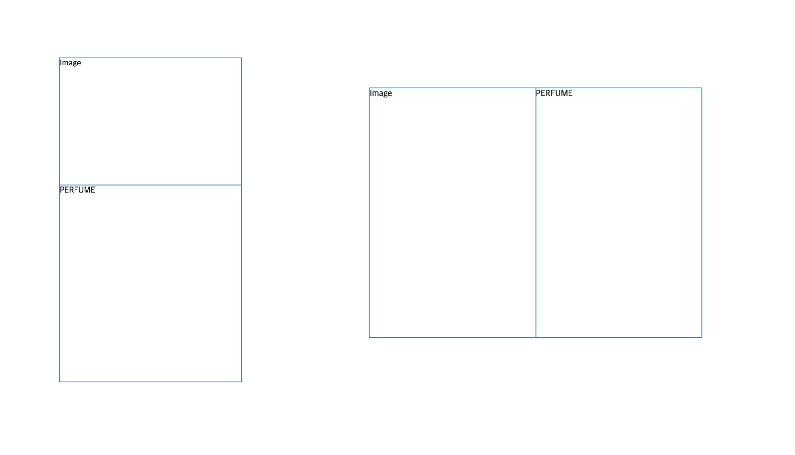
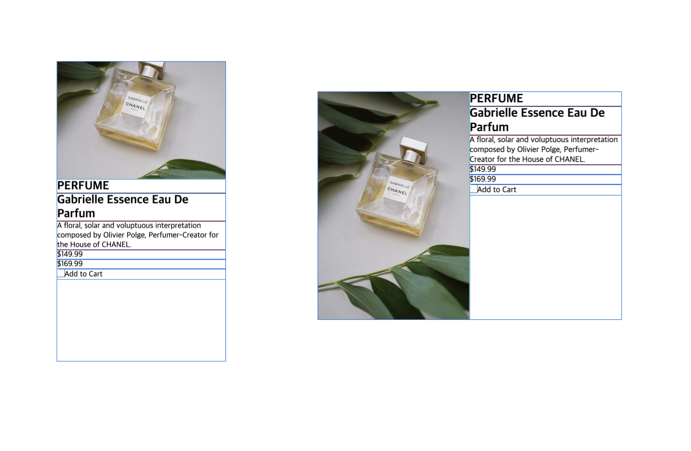
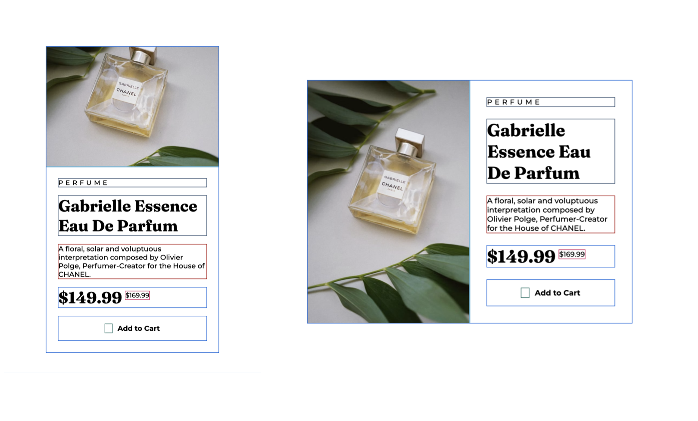
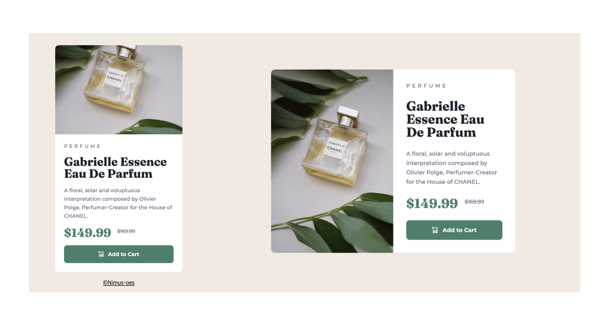

# Product Preview Card

<br>
<p align="center">

</p>
<p align="center">

</p>
<p align="center">A product preview card built with HTML and CSS</p>

<p align="center"><a href="https://nimus-oes.github.io/frontend/05-Product%20Preview%20Card/">Live Site Link</a> 🔗</p>

<p></p>
<br>

## Table of Contents

- [Key Features](#key-features)
- [Development Process](#development-process)
- [What I learned](#what-i-learned)
  - [Accessibility from the Perspective of Browser Default Font Size](#accessibility-from-the-perspective-of-browser-default-font-size)
  - [Responsive Images](#responsive-images)
  - [How to Implement Strikethrough Text with Accessibilty in Mind](#how-to-implement-strikethrough-text-with-accessibilty-in-mind)
- [Improvement Logs](#improvement-logs)
- [Continued Development](#continued-development)
- [Annotations (Resources)](<#annotations-(resources)>)
- [Acknowledgments](#acknowledgments)

<br>

## Key Features

- Responsive layout switching from a single column on mobile to a two-column layout on desktop using CSS grid
- Responsive images that adjust art directions for mobile and desktop screens using `<picture>`
- Accessible text and elements that scales with default font size of browsers using a relative unit `rem`
- Strikethrough text with visually hidden information for enhanced accessibility
- Hover effects on the button using the pseudo-class `:hover`

<br>

## Development Process

1. Designed the basic layout for mobile and desktop screens using CSS grid
   
2. Structured the content with semantic HTML tags and set up responsive images  
   
3. Applied typography and implemented spacing with flexbox
   
4. Added visual details and finishing touches
   

<br>

## What I learned

### 1. Accessibility from the Perspective of Browser Default Font Size

#### Misunderstanding

One misconception I had in accessibility is that using `rem` units alone makes elements scalable to the screen sizes and therefore accessible. However, `rem` only adapts to the default font size settings of the browser - it does not inherently adjust to screen size unless you specify to do so with media queries.
<br><br>

#### Responsiveness ≠ Accessibility

There are many requirements to making website accessible for people with different needs, ranging from screen reading to keyboard navigation. While creating a responsive website that adapts its layout to different device sizes can help improve accessibility, it’s only one part of the process and not enough on its own. As Jim Byrne stated<sup>1</sup>, a responsive website responds to screen size and an accessible website responds to a users’ access needs.
<br><br>

#### Browser Default Font Sizes Vary

For accessibility, it’s essential to consider that users may increase their browser’s default font size for better readability. Accessible designs maintain a solid layout that doesn't break even when the font size is scaled up significantly.
<br><br>

#### Why Use `rem` Instead of `px` for Accessibility

The `rem` unit is based on the root font size, so if users increase the default font size, elements sized in `rem` will adjust accordingly. In contrast, `px` remains fixed, regardless of user settings. `rem` is generally better for font sizes and layout elements that need to be flexible to match user preferences.
<br><br>

#### `rem` Isn't One-Size-Fits-All Solution

There are cases where `px` can still be useful, such as for borders or padding where scaling with font size isn’t necessary. It’s worth considering whether the value should scale up as the user increases their browser's default font size. Testing these choices by adjusting the browser font size helps in deciding when to use `rem` vs. `px`.<sup>2</sup>
<br><br>

#### Design Choices for This Project

- `rem`
  - Main containers (`#image-container` and `#detail-container`) - should expand if text size increases
  - Media queries - to ensure the layout adjusts to available screen space, considering font size rather than just physical screen dimensions
  - Line heights - prevents text overlap at larger font sizes
- `px`
  - Padding - does not need to scale with font size, especially on smaller screens where space is limited due to the increased font size

<br>

### 2. Responsive Images

#### Why Use HTML for Responsive Images

Responsive images should be implemented with `<picture>` or `` HTML element, rather than relying solely on CSS or JavaScript. It is because browsers begin downloading images as soon as they find them in the HTML before CSS and JavaScript are loaded. By the time CSS and JavaScript runs to switch image sources, the original image has often already been downloaded, which can lead to downloading multiple versions of the same image, wasting bandwidth and slowing page load times.<sup>3</sup>
<br><br>

#### Two Challenges with Responsive Images

Implementing responsive images in HTML depends on the specific challenge you need to solve:

- **Art Direction Problem**: This focuses on displaying the key parts of an image on various screen sizes. It often involves using images that are cropped or zoomed to highlight the essential parts, rather than just compressing the original. The `<picture>` element is typically used to address this issue.

- **Resolution Switching Problem**: This deals with displaying different image resolutions based on display density, viewport size, or other conditions. The `` element is often used for this issue, along with `srcset` to switch between resolutions.
  <br><br>

#### `<picture>` vs. `` for Art Direction Switching

While both `<picture>` and `` can seem to achieve same results, each has dinstinct advantages depending on your needs. In this project, `<picture>` was used for art direction switching for the following reasons:

- With ``, you need to set a slot width for each image source, which can make conditions complicated when you only need to switch between mobile and desktop versions. With `<picture>`, you can simply define media queries for this.
- When `` is used with `srcset` and slot width, browsers select the optimal image resolution based on multiple factors, which doesn’t always yield consistent or predictable results due to the complexity of the decision-making process.

In short, using `` with `<srcset>` may be overkill for a simple mobile-to-desktop image switch.
<br><br>

#### How to Use `<picture>` the Right Way

_Why the Image Gets Pushed Out of the Container_

With `<picture>`, you should define the width and height of the images on `` element, not on `<source>`. The `<source>` element is only meant to contain different image sources for various screens. The actual size control should be applied to the `` element. If you set physical width and height values on the `<source>` element, it will occupy space on the screen, thus pushing down the actual `` element.

_Why the Image Doesn't Fit into the Cotainer_

Even if the `source` element doesn't have width and height values, the image might still not properly fit in its container, creating blank space on the left and bottom edges. This is often because the image isn't set as a block element. Applying `display: block` can resolve this issue.
<br><br>

### 3. How to Implement Strikethrough Text with Accessibilty in Mind

#### Most Screen Readers Don't Support `<s>`

While the `<s>` element is a semantic HTML tag used to indicate that content is no longer accurate or relevant, it has a major problem that most screen readers do not recognize it. This can be a serious issue for visually impaired users, especially since strikethrough text is often used in modern e-commerce to show the original price before a discount.

As Dennis Lembree’s research on accessibility</a> showed<sup>4</sup>, the most appropriate solution that applies to all screen readers is to add informative text next to the price and visually hide it.
<br><br>

#### Why `display: none` Doesn't Work for Screen Reader-Only Text

Using `display: none` hides an element not just visually, but also removes it from the accessibility tree, making it inaccessible to screen readers. For screen readers to recognize an element, it needs to occupy some space, even if it’s minimal. To make an element hidden visually but still available to assistive technology, you can create a tiny element with a size of `1px` by `1px` and restrict its visibility using `clip` or absolute positioning.

```
.sr-only {
  position: absolute;
  left: -10000px;
  top: auto;
  width: 1px;
  height: 1px;
  overflow: hidden;
}
```

<br>

## Improvement Logs

- Simplified font-family declarations by using utility classes instead of redundant CSS variables.
- Switched the main container layout from Flexbox to a Grid system for easier control.
- Replaced two `<section>` containers in the product card with a single `<article>` element.

<br>

## Continued Development

- Lazy loading for images is not currently necessary since all elements need to load simultaneously. However, it might be beneficial to implement it in future projects.
- Using `<svg>` and `<path>` offers much better control over vector icons compared to ``. Learning how to work with these elements will be a focus moving forward.

<br>

## Annotations (Resources)

1. [What is responsive website design and how does it relate to accessibility](https://jimbyrne.co.uk/what-is-responsive-website-design-and-how-does-it-relate-to-accessibility/) by Jim Byrne
2. [The Surprising Truth About Pixels and Accessibility](https://www.joshwcomeau.com/css/surprising-truth-about-pixels-and-accessibility/) by Josh Comeau
3. [Responsive images](https://developer.mozilla.org/en-US/docs/Learn/HTML/Multimedia_and_embedding/Responsive_images) by MDN
4. [Strikethrough Accessibility](https://www.joshwcomeau.com/css/surprising-truth-about-pixels-and-accessibility/) by Web Axe

<br>

## Acknowledgments

This project is inspired by <a href="https://www.frontendmentor.io/challenges/product-preview-card-component-GO7UmttRfa" target="_blank">the challenge from Frontend Mentor</a>.
